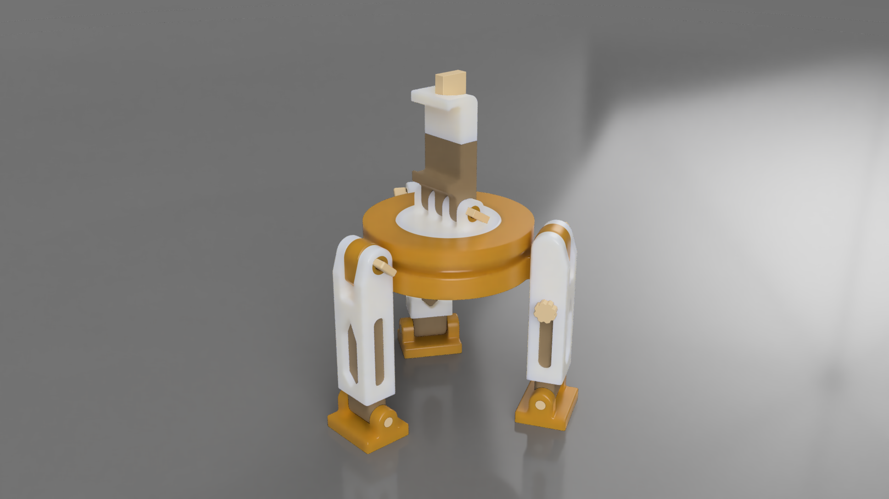

# Phone Tripod made in Autodesk Fusion

This project showcases a highly functional, compact, and fully adjustable telescopic phone tripod designed and modeled in Autodesk Fusion. The design balances geometric stability with practical mechanical features, making it ideal for desktop recording, time-lapse photography, and video conferencing. Based on the visualization in PhoneTripodRender.PNG, the model uses a clean, modern aesthetic with a dual-tone color scheme (warm ochre/gold and matte white) optimized for multi-part 3D printing.

## Components

- Phone Support Base: it represents the part holding the phone; it connects to the rotating platform and it houses the guide rods and the tightening screw for the phone support
- Phone Support Top: it represents the upper part of the phone support; used to complete the clamp
- 2 x Guide Rod: used to guide the phone support top part while sliding up and down
- Tightening Screw (Phone Support): used to tighten the clamp and fix the phone in place
- Support Rotating Platform: it holds the entire phone support structure; it can rotate 360 deg around the Z-axis
- Pivot Pin (Phone Support): used to link the support to the platform
- Tightening Screw Rotating Platform: used to fix in place the entire phone support structure
- Rotating Support Frame: it houses the rotating platform and has the links for the legs; composed of two parts: the Main Piece (the housing part) and the Cap (the part that fixes the rotating platform into place)
- 3 x Main Leg Structure: it connects to the rotating support frame using a pivot; it houses the leg extensions
- 3 x Leg Fixing Screw: used to fix the desired position of the leg
- 3 x Leg Pivot: used to link the leg to the rotating support frame
- 3 x Leg Extension: permits the extension of the leg length
- 3 x Leg Extension Fixing Screw: used to set the position of the leg extension; composed of two parts: the fillet section that fillets into the leg extension and the knob to control the screw
- 3 x Leg Pads: used to offer better stability to the entire structure
- 3 x Leg Pads Pivot: used to link the leg pads to the leg extension

## Resources

- Source of inspiration: https://www.thingiverse.com/thing:2760396
- Preview of the presented source of inspiration: https://www.youtube.com/watch?v=xiLtBLJmahg

## Phone Tripod Functionality Demo

The functionalities implemented by the described phone tripod can be seen here: https://youtu.be/XHS9TnAxXn8